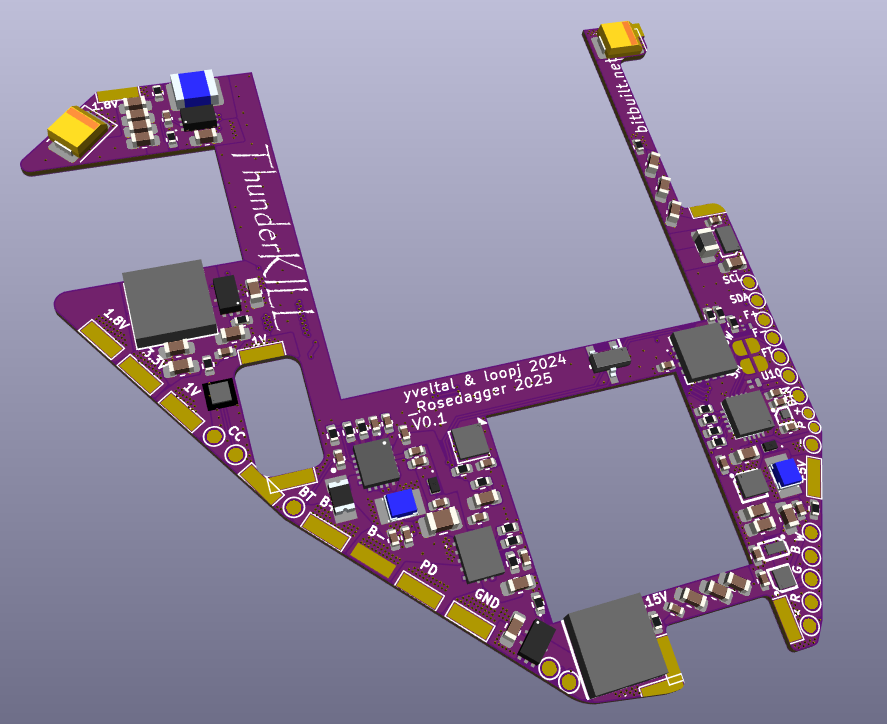
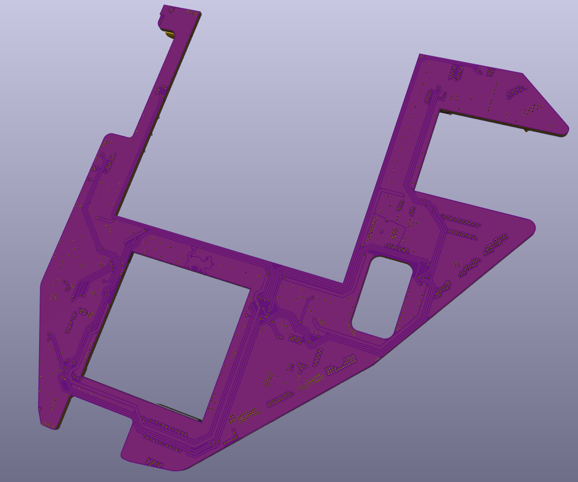
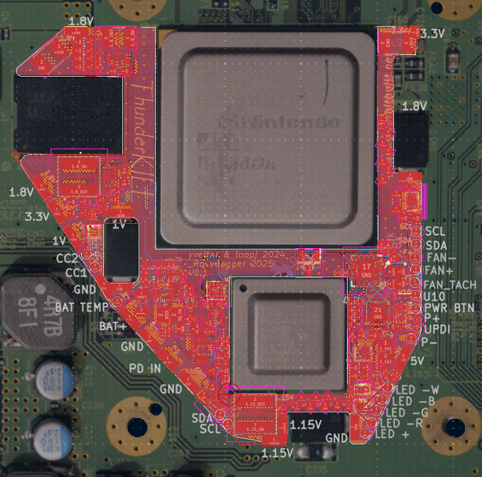

# ThunderKILL

ThunderKILL is based on the [Thundervolt](https://github.com/mackieks/thundervolt/tree/main)  by  [YveltalGriffin](https://github.com/mackieks) an open source platform for undervolting the Nintendo Wii's.
ThunderKILL takes the original concept and tries to go overkill with them, adding more features.
New features:
- USB C Power deliver
- Battery charge controller
- Fan and temperature controller
- RGB led controller
- Current sensing
- 5V boost
- E-Fuse on the PD power in
- Resettable fuse on the battery connection

Existing features from Thundervolt:
- 1V Buck
- 1.15V Buck
- 1.8V Buck
- 3.3V Buck Boost

All regulators are I2C controlled and high efficiency (η > 90%) and can be(/will be) controllable from a homebrew app. Along with the data from the I2C current/voltage/power sensing and temperature sensing of the board and the Wii.
The ThunderKILL has significantly more output pads than the original Thundervolt, as it is designed to integrate with other boards beyond the Wii it self, supplying easily available power, along with all the new features like PD negotiation, fan and led outputs.

NOTE: ThunderKILL is still in the prototype phase, and is untested, and the firmware for it has yet to be developed. I don't recommend anyone print and manufacture the ThunderKILL yet till development is done and tested. This project is currently only for reference.

(This github page is still WIP, and will change as the project continues)

## Screenshots

## Credits

ThunderKILL hardware designed by [RoseDaggerDev](https://github.com/RoseDaggerDev)

Original Thundervolt credits:
Thundervolt hardware designed by [YveltalGriffin](https://github.com/mackieks)

Thundervolt firmware by [loopj ](https://github.com/loopj)

Thundervolt homebrew by:
- [YveltalGriffin](https://github.com/mackieks) (UI, app)
-  [loopj ](https://github.com/loopj) (I2C, app)
-  [Alex/supertazon](https://github.com/supertazon) (graphics)
-  [ShockSlayer ](https://github.com/ShockSlayer) (music)

## License

ThunderKILL hardware is licensed under Solderpad Hardware License v2.1.
